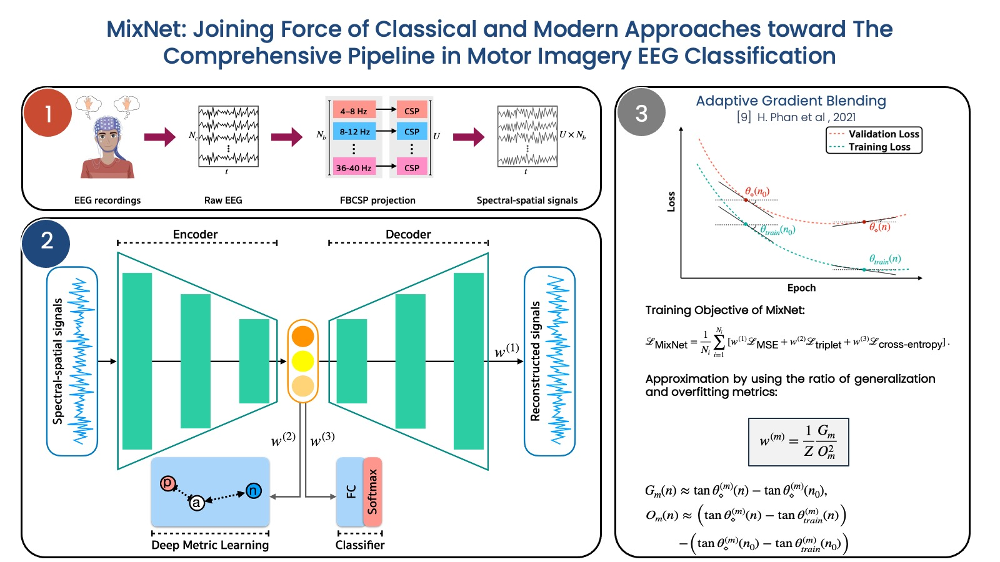

## MixNet: Joining Force of Classical and Modern Approaches toward The Comprehensive Pipeline in Motor Imagery EEG Classification

<p align="center"> 
 
</p>

## Abstract 
Recent advances in deep learning (DL) have significantly impacted motor imagery (MI)-based brain-computer interface (BCI) systems, enhancing the decoding of electroencephalography (EEG) signals. However, most studies struggle to identify discriminative patterns across subjects during MI tasks, leading to limited MI classification performance. In this paper, we propose MixNet, a novel classification framework designed to overcome this limitation by utilizing spectral-spatial signals from MI data, along with a multi-task learning architecture named MIN2Net, for classification. Here, the spectral-spatial signals are generated by adopting the filter-bank common spatial patterns (FBCSP) method on MI data. Since the multi-task learning architecture is used for the classification task, the learning in each task may exhibit different generalization rates and potential overfitting across tasks. To address this issue, we implement adaptive gradient blending in our multi-task learning architecture, simultaneously regulating multiple loss weights and adjusting the learning pace for each task based on its generalization/overfitting tendencies. Experimental results on five benchmark datasets of different data sizes demonstrate that MixNet consistently outperforms all state-of-the-art algorithms in both subject-dependent and -independent settings. Finally, the low-density EEG-MI classification results show MixNet's superiority over state-of-the-art algorithms, offering promising implications for real-world applications such as EEG classification of signals from lightweight and portable EEG wearable devices based on low-density montages.

### Note ###
```bash
All source codes will be uploaded once this paper is accepted.
```

### License
Copyright &copy; 2023-All rights reserved by [INTERFACES (BRAIN lab @ IST, VISTEC, Thailand)](https://www.facebook.com/interfaces.brainvistec).
